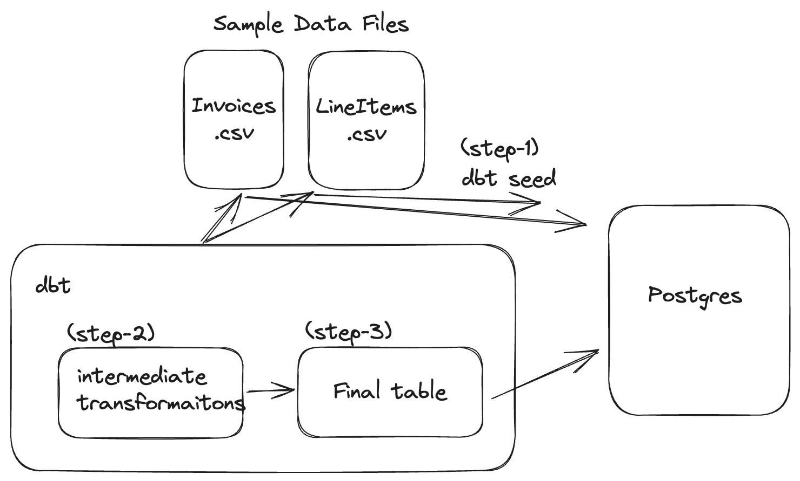

<div align="center">
    <h1>Data Skills</h1>
</div>

<br />

<p align="center">
  
</p>


## Table of contents
1. [What are the project requirements?](#project-requirements)
2. [1. Appraoch - Postgres and dbt](#1-appraoch---postgres-and-dbt)
3. [2. Approach - Using different AWS services](#2-approach---using-different-aws-services)


## Project Requirements
- docker and docker-compose
- python version 3.11
- pipenv for python virtual environment


## 1. Appraoch - Postgres and dbt
- Postgres is used as database/data-warehousing solution
- dbt is used to generate transformations which are run on Postgres to generate final table
- Below is the lineage of different steps starting from raw data tables to the final table

<p align="center">
  
</p>


### Project Set Up

First we need to create the PostgreSQL database. To do so, just change directory to `database` and execute:
```
$ docker-compose up
```
This command will spin a PostgreSQL database on localhost and port 5432, and will create the `raw` database.

Once the database is ready, we can install `dbt` and other python dependencies:
```
$ pipenv install
```


Lets check if the connection to the Postgres and configs are okay. Run this command and everythign should be green:
```
$ dbt debug --profiles-dir .
```


Now we should we have added sample data under `dbt_project/seed` directory. Switch to the directory `dbt_project` in terminal and run below command:
```
$ dbt seed --profiles-dir .
```
This will load all the csv file under `seeds/` directory as tables with name of the files as table names.


Once sample data is loaded, run below command to execute all data transformation queries under `models/` directory:
```
$ dbt run --profiles-dir .
```
This will run all the modles defined on the `models` directory. 
The final table is under `raw` database and `dev` schema, named as `dim_finance__final_table`.


Once sample data is loaded, run below command to execute all data transformation queries under `models/` directory:
```
$ dbt test --profiles-dir .
```
This will run all the tests defined in yaml schema file on table level as well as column level to ensure the quality of the produced data. For more details follow [dbt tests](https://docs.getdbt.com/docs/build/tests).


## 2. Approach - Using different AWS services.
To obtain a clean table using different AWS services, the following steps can be followed:

- The LineItems.csv and Invoices.csv tables should be stored in an Amazon S3 bucket. This storage solution offers scalability and durability for the raw data.

- AWS Glue can be used for data integration. A Glue crawler should be created to discover and catalog the tables in the S3 bucket. This crawler will automatically create a data catalog that includes metadata about the tables. The common column between the LineItems and Invoices tables will be used by the crawler to combine them into one table.

- After the tables have been integrated, AWS Glue or AWS Athena or Redshift can be used to do data cleansing, transformaiton and modelling for downstream use cases.

- In case of Redshift, we can load raw data to Redshift using COPY command or use Redschift Spectrum to query directly from S3. Through SQL queries, data can be cleansed, transformed and modelled for further use cases.

- In case of Athena or Glue for data transformation and cleansing part, data is queried directly from S3. So no data movement is required.


By leveraging AWS Glue, Amazon Athena, and Amazon Redshift, the raw data tables can be efficiently processed, enabling data integration, cleansing, transformation, deduplication to obtaining the desired modifications in the data for different purposes.


## Resources:
- Learn more about dbt [in the docs](https://docs.getdbt.com/docs/introduction)
