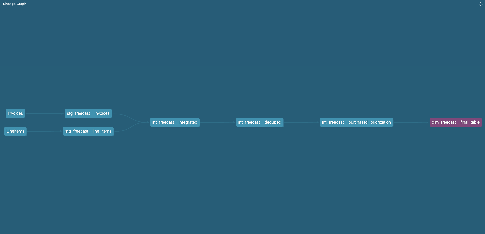

<div align="center">
    <h1>dbt Project part</h1>
</div>

<p align="center">
  
</p>


## Steps to run

Lets check if the connection to the Postgres and configs are okay. Run this command and everythign should be green:
```
$ dbt debug --profiles-dir .
```


Now we should we have added sample data under `dbt_project/seed` directory. Switch to the directory `dbt_project` in terminal and run below command:
```
$ dbt seed --profiles-dir .
```
This will load all the csv file under `seeds/` directory as tables with name of the files as table names.


Once sample data is loaded, run below command to execute all data transformation queries under `models/` directory:
```
$ dbt seed --profiles-dir .
```
This will run all the modles defined on the `models` directory. For more details follow [dbt docs](https://docs.getdbt.com/docs/introduction).


## Resources:
- Learn more about dbt [in the docs](https://docs.getdbt.com/docs/introduction)
